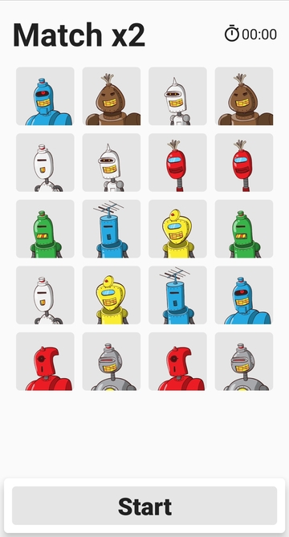
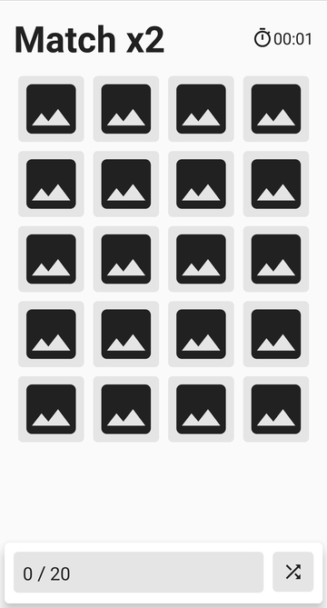
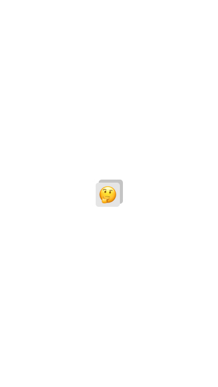

# Memory Mania

An android application meant to implement a popular memory matching game. Built for shopify's fall term internship application.

[Link](https://github.com/arshwaraich12/MemoryMania/releases) to final submission build.

## Design
Figma [UI design](https://www.figma.com/file/Ewj2lUbHzuIE9Bium00EDz/Shopify-Memory-Mania?node-id=0%3A1) and [Interactive prototype](https://www.figma.com/proto/Ewj2lUbHzuIE9Bium00EDz/Shopify-Memory-Mania) - A clean and simple design that highlights actions over graphics.

Screen | Design | Implementation
---|---|---
**Home screen**|||
**Settings**: decided against reinventing the wheel for the UI and just used the default SettingsActivity that uses [PreferenceFragmentCompat](https://developer.android.com/reference/androidx/preference/PreferenceFragmentCompat). ||
**Game view**: Design had a floating ViewGroup for score feedback with everything below it inside a ScrollView. As well as a stack of cards at the top for matched cards. Decided against it as it took too much real estate and it wasn't ideal to put a RelativeLayout grid inside a Scrollview.  ||
**Applause + share screen**: Changed text to Good job instead of you won because `you can't lose, only quit`. Oddly inspirational.||

### Gameplay screenshots
Screen | Implementation
---|---
**No cards matched**|
**Some cards matched**: Cool flip animation here.|
**User won**|

## Other

### Localization (en-CA | fr-CA)
Added localization for language codes en-CA and fr-CA. I never had a chance to implement localization before so decided to try it out in this project.  
  
Gave the translations my best shot but it is basically guess work + google translate at my level of french. Pre-emptive sorry for any gaffe to any french canadian who has to read through this.  
  

### Share
Added an option to share game results to promote the app as well as it's creator. Also supports french and english.  
  

### App icons and splash screen
The design originally had a splash screen with the app icon at the center, but i decided against implementing it as the app was already super quick to load.  
  
  
Designed app icons using vector assets in [Android asset studio](https://github.com/romannurik/AndroidAssetStudio)

### Settings
Added configurable grid size, match size and total matches.  
  

## Third Party Libraries
1. [Retrofit](https://square.github.io/retrofit/) - A type-safe HTTP client for Android and Java
2. [Converter GSON](https://github.com/square/retrofit/blob/master/retrofit-converters/gson/README.md) - A Converter which uses Gson for serialization to and from JSON.
3. [Picasso](https://github.com/square/picasso) - A powerful image downloading and caching library for Android

## Note
Was really fun to build, tried and learned quite a few new things in the android framework. The jetpack library is cool. Data binding is a very neat concept to have, coming from react native.
